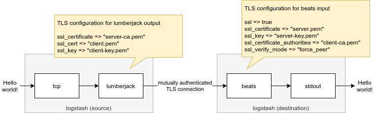

# Demo: logstash lumberjack output with mutual TLS authentication

> **WARNING**: This demo depends on forked versions of logstash-output-lumberjack and ruby-lumberjack. **Note that ruby-lumberjack (the lumberjack v1 protocol implementation) is deprecated, so this is not a long term solution!**

This demo shows how mutual TLS authentication could be implemented with lumberjack output.
Beats input is used as destination.




For required code changes, see

* https://github.com/logstash-plugins/logstash-output-lumberjack/compare/master...tsaarni:client-cert
* https://github.com/elastic/ruby-lumberjack/compare/master...tsaarni:client-cert


## Instructions

### 1. Preparations

Download `certyaml` to create certificate

```console
$ curl https://github.com/tsaarni/certyaml/releases/download/v0.5.0/certyaml-linux-amd64.tar.gz -o certyaml.tar.gz
$ tar zxvf certyaml.tar.gz
$ chmod +x certyaml
```

Generate client and server certificates


```console
$ mkdir -p certs
$ certyaml -d certs
Loading manifest file: certs.yaml
Reading certificate state file: certs/certs.state
Writing: certs/client-ca.pem certs/client-ca-key.pem
Writing: certs/server-ca.pem certs/server-ca-key.pem
Writing: certs/client.pem certs/client-key.pem
Writing: certs/server.pem certs/server-key.pem
Writing state: certs/certs.state
```

### 2. Successful authentication

Start the demo and wait for the containers to spin up

```console
$ docker-compose up
```

Send data to the TCP input of the source logstash
```console
$ echo "Hello world!" > /dev/tcp/localhost/9999
```

Observe that destination logstash prints the message to `stdout`

```
{
          "tags" => [
        [0] "beats_input_codec_plain_applied"
    ],
      "@version" => "1",
    "@timestamp" => 2021-08-03T13:46:14.710Z,
       "message" => "2021-08-03T13:46:14.476Z 172.22.0.1 Hello world!"
}
```

### 3. Unsuccessful authentication

To validate that mutual authentication actually happens, replace `client.pem` and `client-key.pem` in `logstash-source.conf` with e.g. server cert and key.
Restart the containers.

Source logstash will print following error message

```
[2021-08-03T13:57:02,097][ERROR][logstash.outputs.lumberjack][main] All hosts unavailable, sleeping {:hosts=>["172.22.0.2"], :e=>#<OpenSSL::SSL::SSLError: Received fatal alert: certificate_unknown>, :backtrace=>["org/jruby/ext/openssl/SSLSocket.java:265:in `connect'", "/usr/share/logstash/vendor/bundle/jruby/2.5.0/gems/jls-lumberjack-0.0.26/lib/lumberjack/client.rb:107:in `connection_start'", "/usr/share/logstash/vendor/bundle/jruby/2.5.0/gems/jls-lumberjack-0.0.26/lib/lumberjack/client.rb:86:in `initialize'", "/usr/share/logstash/vendor/bundle/jruby/2.5.0/gems/jls-lumberjack-0.0.26/lib/lumberjack/client.rb:39:in `connect'", "/usr/share/logstash/vendor/bundle/jruby/2.5.0/gems/jls-lumberjack-0.0.26/lib/lumberjack/client.rb:29:in `initialize'", "/usr/share/logstash/vendor/bundle/jruby/2.5.0/gems/logstash-output-lumberjack-3.1.8/lib/logstash/outputs/lumberjack.rb:94:in `connect'", "/usr/share/logstash/vendor/bundle/jruby/2.5.0/gems/logstash-output-lumberjack-3.1.8/lib/logstash/outputs/lumberjack.rb:58:in `register'", "org/logstash/config/ir/compiler/OutputStrategyExt.java:131:in `register'", "org/logstash/config/ir/compiler/AbstractOutputDelegatorExt.java:68:in `register'", "/usr/share/logstash/logstash-core/lib/logstash/java_pipeline.rb:228:in `block in register_plugins'", "org/jruby/RubyArray.java:1809:in `each'", "/usr/share/logstash/logstash-core/lib/logstash/java_pipeline.rb:227:in `register_plugins'", "/usr/share/logstash/logstash-core/lib/logstash/java_pipeline.rb:585:in `maybe_setup_out_plugins'", "/usr/share/logstash/logstash-core/lib/logstash/java_pipeline.rb:240:in `start_workers'", "/usr/share/logstash/logstash-core/lib/logstash/java_pipeline.rb:185:in `run'", "/usr/share/logstash/logstash-core/lib/logstash/java_pipeline.rb:137:in `block in start'"]}
```

and destination logstash will print

```
[2021-08-03T13:57:02,099][INFO ][org.logstash.beats.BeatsHandler][main][204127c45d5e42f8b8ff34e01396ab9ca87d92b6d10685afd42937f660cd4758] [local: 0.0.0.0:12345, remote: 172.22.0.3:49576] Handling exception: io.netty.handler.codec.DecoderException: javax.net.ssl.SSLHandshakeException: PKIX path building failed: sun.security.provider.certpath.SunCertPathBuilderException: unable to find valid certification path to requested target (caused by: sun.security.provider.certpath.SunCertPathBuilderException: unable to find valid certification path to requested target)
```

## Observations

**(1)** Following error will be printed by lumberjack output every time after the connection between source and destination has timed out and new data is being sent to output.  Re-connecting succeeds and no data seems to be lost during this error.

```
[2021-08-03T13:47:23,079][ERROR][logstash.outputs.lumberjack][main][4f1ca749657f880b258063c879add5c6649b07f096b6328468d99224386f13c9] Client write error, trying connect {:e=>#<IOError: Connection reset by peer>, :backtrace=>["org/jruby/ext/openssl/SSLSocket.java:931:in `syswrite'", "/usr/share/logstash/vendor/bundle/jruby/2.5.0/gems/jls-lumberjack-0.0.26/lib/lumberjack/client.rb:119:in `send_window_size'", "/usr/share/logstash/vendor/bundle/jruby/2.5.0/gems/jls-lumberjack-0.0.26/lib/lumberjack/client.rb:139:in `write_sync'", "/usr/share/logstash/vendor/bundle/jruby/2.5.0/gems/jls-lumberjack-0.0.26/lib/lumberjack/client.rb:47:in `write'", "/usr/share/logstash/vendor/bundle/jruby/2.5.0/gems/logstash-output-lumberjack-3.1.8/lib/logstash/outputs/lumberjack.rb:73:in `flush'", "/usr/share/logstash/vendor/bundle/jruby/2.5.0/gems/stud-0.0.23/lib/stud/buffer.rb:219:in `block in buffer_flush'", "org/jruby/RubyHash.java:1415:in `each'", "/usr/share/logstash/vendor/bundle/jruby/2.5.0/gems/stud-0.0.23/lib/stud/buffer.rb:216:in `buffer_flush'", "/usr/share/logstash/vendor/bundle/jruby/2.5.0/gems/stud-0.0.23/lib/stud/buffer.rb:159:in `buffer_receive'", "/usr/share/logstash/vendor/bundle/jruby/2.5.0/gems/logstash-output-lumberjack-3.1.8/lib/logstash/outputs/lumberjack.rb:61:in `block in register'", "/usr/share/logstash/vendor/bundle/jruby/2.5.0/gems/logstash-codec-plain-3.0.6/lib/logstash/codecs/plain.rb:40:in `encode'", "/usr/share/logstash/logstash-core/lib/logstash/codecs/delegator.rb:48:in `block in encode'", "org/logstash/instrument/metrics/AbstractSimpleMetricExt.java:65:in `time'", "org/logstash/instrument/metrics/AbstractNamespacedMetricExt.java:64:in `time'", "/usr/share/logstash/logstash-core/lib/logstash/codecs/delegator.rb:47:in `encode'", "/usr/share/logstash/vendor/bundle/jruby/2.5.0/gems/logstash-output-lumberjack-3.1.8/lib/logstash/outputs/lumberjack.rb:67:in `receive'", "/usr/share/logstash/logstash-core/lib/logstash/outputs/base.rb:105:in `block in multi_receive'", "org/jruby/RubyArray.java:1809:in `each'", "/usr/share/logstash/logstash-core/lib/logstash/outputs/base.rb:105:in `multi_receive'", "org/logstash/config/ir/compiler/OutputStrategyExt.java:143:in `multi_receive'", "org/logstash/config/ir/compiler/AbstractOutputDelegatorExt.java:121:in `multi_receive'", "/usr/share/logstash/logstash-core/lib/logstash/java_pipeline.rb:295:in `block in start_workers'"]}
```


**(2)** The current implementation presented here, adapted from syslog output, supports only RSA certificates.  Following error is given if EC (Elliptic Curve) is used

```
[2021-08-03T13:25:22,063][ERROR][logstash.outputs.lumberjack][main] All hosts unavailable, sleeping {:hosts=>["172.22.0.2"], :e=>#<OpenSSL::PKey::RSAError: Neither PUB key nor PRIV key:>, :backtrace=>["org/jruby/ext/openssl/PKeyRSA.java:310:in `initialize'", "/usr/share/logstash/vendor/bundle/jruby/2.5.0/gems/jls-lumberjack-0.0.26/lib/lumberjack/client.rb:104:in `connection_start'", "/usr/share/logstash/vendor/bundle/jruby/2.5.0/gems/jls-lumberjack-0.0.26/lib/lumberjack/client.rb:86:in `initialize'", "/usr/share/logstash/vendor/bundle/jruby/2.5.0/gems/jls-lumberjack-0.0.26/lib/lumberjack/client.rb:39:in `connect'", "/usr/share/logstash/vendor/bundle/jruby/2.5.0/gems/jls-lumberjack-0.0.26/lib/lumberjack/client.rb:29:in `initialize'", "/usr/share/logstash/vendor/bundle/jruby/2.5.0/gems/logstash-output-lumberjack-3.1.8/lib/logstash/outputs/lumberjack.rb:94:in `connect'", "/usr/share/logstash/vendor/bundle/jruby/2.5.0/gems/logstash-output-lumberjack-3.1.8/lib/logstash/outputs/lumberjack.rb:58:in `register'", "org/logstash/config/ir/compiler/OutputStrategyExt.java:131:in `register'", "org/logstash/config/ir/compiler/AbstractOutputDelegatorExt.java:68:in `register'", "/usr/share/logstash/logstash-core/lib/logstash/java_pipeline.rb:228:in `block in register_plugins'", "org/jruby/RubyArray.java:1809:in `each'", "/usr/share/logstash/logstash-core/lib/logstash/java_pipeline.rb:227:in `register_plugins'", "/usr/share/logstash/logstash-core/lib/logstash/java_pipeline.rb:585:in `maybe_setup_out_plugins'", "/usr/share/logstash/logstash-core/lib/logstash/java_pipeline.rb:240:in `start_workers'", "/usr/share/logstash/logstash-core/lib/logstash/java_pipeline.rb:185:in `run'", "/usr/share/logstash/logstash-core/lib/logstash/java_pipeline.rb:137:in `block in start'"]}
```
